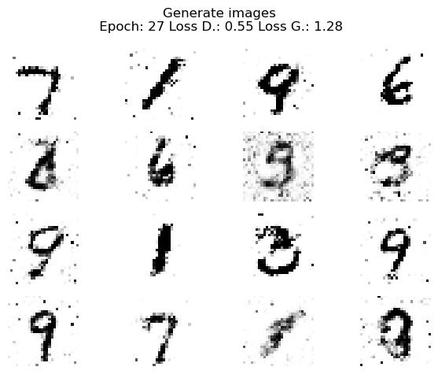

# Answers

## Exercise 1
1. It does not print the fruit at the correct index, why is the returned result wrong?

   Sets in Python are implemented using hash tables. Sets do not maintain any specific order of insertion. The order of elements is not guaranteed during iterations.

2. How could this be fixed?

   One of the solutions is to use a `List`. Lists maintain order and fast access with time complexity of O(1). If the space complexity is not an issue, then this is a good solution. Another solution is to use a `SortedSet` from the `sortedcontainers` library. This would maintain the order of elements and fast access with time complexity of O(log n).

## Exercise 2
1. Can you spot the obvious error?

   Logic was invalid: coords[:, 0], coords[:, 1], coords[:, 2], coords[:, 3], = coords[:, 1], coords[:, 1], coords[:, 3], coords[:, 2]. It assigned coords[:, 1] to both the first and second columns.

2. After fixing the obvious error it is still wrong, how can this be fixed?

   The array was being modified. Deep-copy in the beginning and working with copy could fix this issue. 

## Exercise 3
1. For some reason the plot is not showing correctly, can you find out what is going wrong?

   The CSV data was being read as strings, but expected floats and columns were incorrectly mapped: code try to plot Recall on the X and Precision on the Y axes.

2. How could this be fixed?

   Explicitly convert the row values to float during parsing and use correct column indices

## Exercise 4
1. Changing the batch_size from 32 to 64 triggers the structural bug.

   batch_size = 64 is realy big for GPU, it can cause OOM error. Also, the dataset size is not divisible by the batch size, the final batch will be smaller. This causes a size mismatch error in the loss function. The fix is to use the actual size of the input tensor.

2. Can you also spot the cosmetic bug?

   Check against the length of the DataLoader: if n == len(train_loader) - 1. Method .detach() to save memory, backpropagate is not needed.

# Output of GAN model

# PC characteristics

Device Name	DESKTOP-5JBKUEH
Processor	Genuine Intel(R) CPU 0000 @ 2.60GHz   3.11 GHz
Installed RAM	32.0 GB (31.8 GB usable)
Storage	3.64 TB HDD ST4000VX016-3CV104, 466 GB SSD Samsung SSD 980 500GB
Graphics Card	NVIDIA GeForce RTX 3060 Ti (8 GB)
Edition	Windows 10 Home
Version	22H2
OS Build	19045.6466
